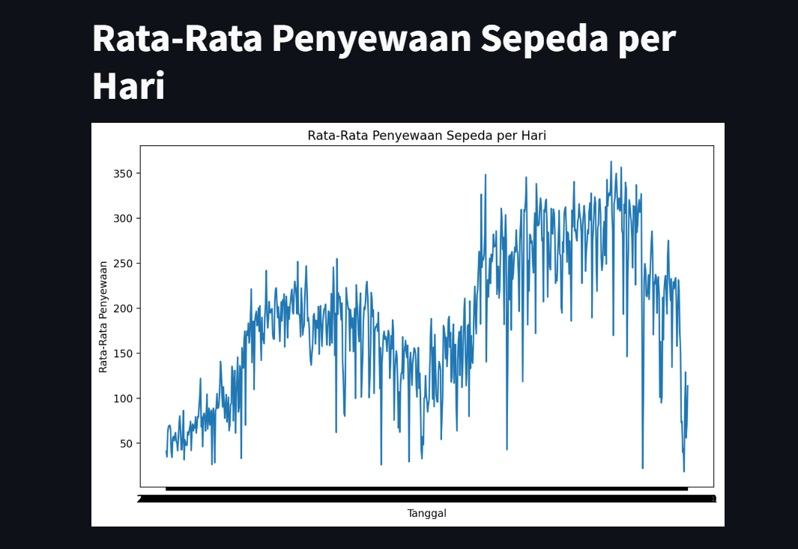
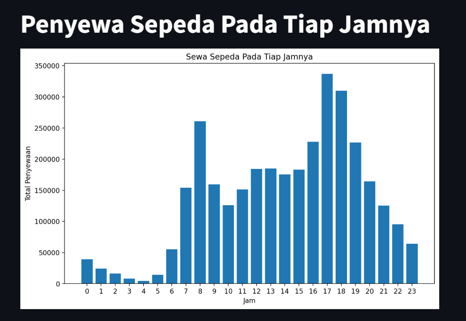
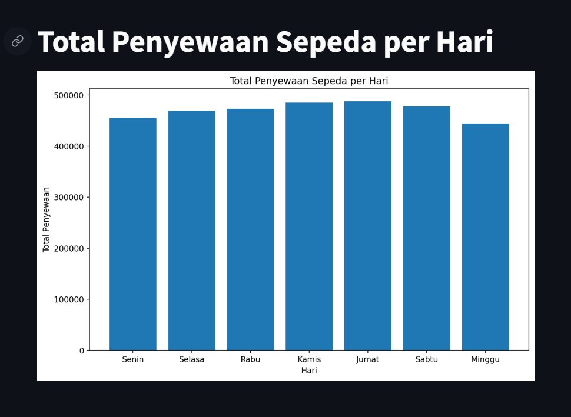

# Proyek-Analisis-Data

## This repository provides a step-by-step guide for analyzing datasets to address business questions:

- Identify Business Questions: Clearly define the specific business problems the analysis aims to solve.
- Data Preparation: Assess, clean, and transform data into a usable format, ensuring its accuracy, completeness, and consistency.
- Exploratory Data Analysis: Uncover patterns, trends, and relationships using data visualization techniques and statistical measures.
- Visualization & Explanatory Analysis: Create informative charts and graphs to effectively communicate insights, and perform in-depth analysis to extract deeper understanding from the data.
- Conclusion: Summarize the key findings of the analysis and draw meaningful conclusions that directly address the business questions.
- Creating a Simple Dashboard: Utilize Streamlit to construct a straightforward and user-friendly dashboard.

# Proyek Analisis Data

## SETUP environement

Run the commands below:
```bash
conda create --name main-ds python=3.9
conda activate main-ds
```
Install the required libraries, such as:

- `numpy`
- `jupyter`
- `matplotlib`
- `pandas`
- `seaborn`
- `streamlit`

Type the command in the terminal:
```bash
pip install numpy jupyter matplotlib pandas seaborn streamlit
```
## Run Streamlit App
Ketikan
```
streamlit run dashboard.py
```

## Display when running Streamlit

**Will display:**
- Average Bike Rentals per Day
  
- Bike Renters at Each Hour
  
- Total Bike Rentals per Day
  
